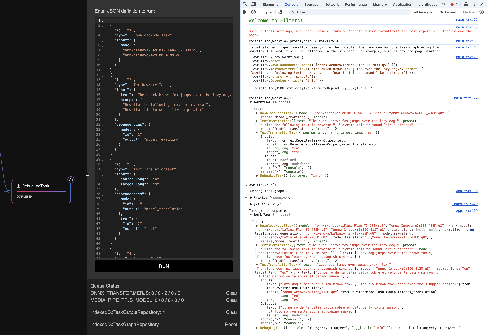

# PODLEY

## Overview

Simple library to build linear and graph based workflows. It is designed to be simple to use and easy to extend, yet powerful enough to handle cross task rate limits, retries, etc.

## Authors

- [Steven Roussey](https://stevenroussey.com)

## Docs

- **[Getting Started](docs/developers/01_getting_started.md)**
- **[Architecture](docs/developers/02_architecture.md)**
- **[Extending the System](docs/developers/03_extending.md)**

Packages:

- **[packages/storage](packages/storage/README.md)**
- **[packages/task-graph](packages/task-graph/README.md)**
- **[packages/job-queue](packages/job-queue/README.md)**

## Examples

### CLI

### Web

[Demo](https://podley-web.netlify.app/)

### Node Editor

