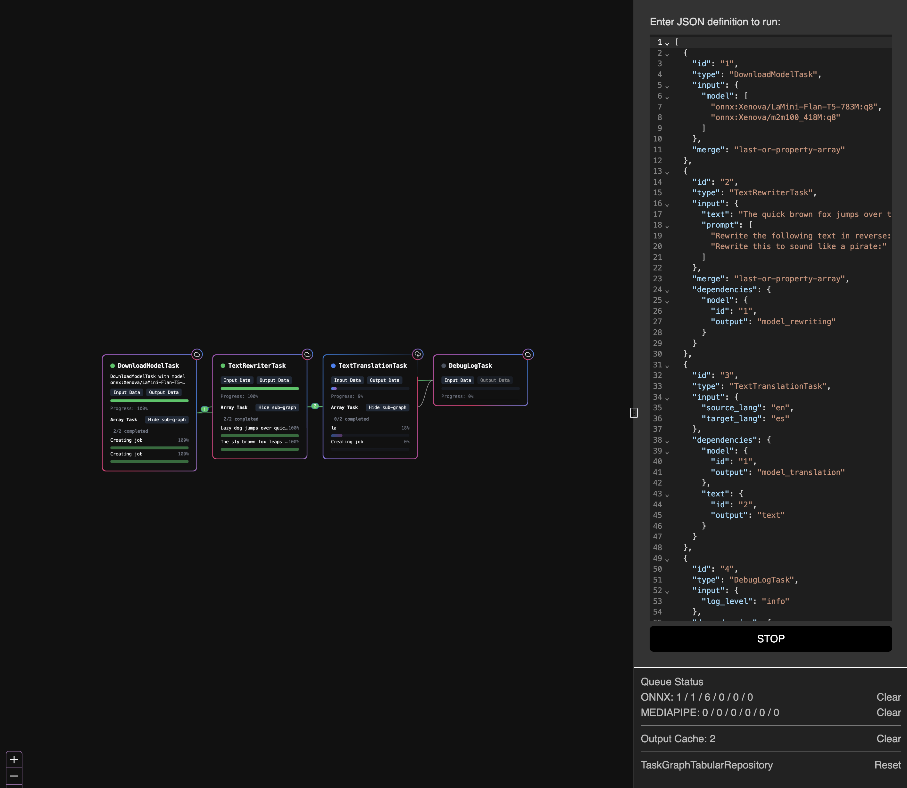

# ELLMERS

## Overview

The Embedding Large Language Model Experiential retrieval Service (ELLMERS) is a simple tool for testing LLM embedding strategies for document retreival. It is designed to be simple to use and easy to extend.

## Features

- Support for multiple LLM models
- Support for differnt instruction transformations
- Support for multiple dimensionalities for testing
- Support for different storage backends
- Support for different retreival strategies
- Support for different document formats

## Authors

- [Steven Roussey](https://stevenroussey.com)

## Docs

- **[Getting Started](docs/developers/01_getting_started.md)**
- **[Architecture](docs/developers/02_architecture.md)**
- **[Extending the System](docs/developers/03_extending.md)**

Packages:

- **[packages/storage](packages/storage/README.md)**
- **[packages/task-graph](packages/task-graph/README.md)**
- **[packages/job-queue](packages/job-queue/README.md)**

## Examples

### CLI

### Web

[Demo](https://ellmers-web.netlify.app/)

### Node Editor

# Task and TaskRunner Refactoring

## Overview

This refactoring separates the task execution logic from the Task class into a new TaskRunner class, similar to how TaskGraph and TaskGraphRunner were previously separated. This improves code organization and follows the single responsibility principle by:

1. Keeping the Task class focused on what a task is (definition, configuration, inputs/outputs)
2. Moving how a task is run to the TaskRunner class

## Changes Made

The key changes include:

### 1. Created a new `TaskRunner` class

- Handles the lifecycle of task execution (start, run, abort, complete, error)
- Manages progress tracking and event emission
- Takes care of provenance and output caching
- Contains all event handling methods (handleStart, handleAbort, handleComplete, handleError, handleProgress)

### 2. Updated the `Task` class to delegate execution

- Added a reference to a TaskRunner instance
- Delegated run methods to the TaskRunner
- Removed all event handling methods (handleStart, handleAbort, handleComplete, handleError, handleProgress)
- Kept the actual task execution logic but made it available to the TaskRunner
- Made execute and executeReactive methods public to allow direct access from TaskRunner

### 3. Refined interfaces to better reflect separation of responsibilities

- Created new `ITaskExecution` interface for task execution logic
  - Contains execute and executeReactive methods
  - Implemented by Task subclasses to define their logic
- Updated `ITaskLifecycle` interface to focus on lifecycle management
  - Contains run, runReactive, and abort methods
  - Delegates to TaskRunner for actual execution
- Added new `ITaskRunner` interface
  - Defines the contract for the TaskRunner class
  - Formalizes the relationship between Task and TaskRunner
- Enhanced code documentation to clarify responsibilities
- Organized Task class into clearer sections with better comments

## Benefits

- **Better separation of concerns**: Task defines what it is, TaskRunner handles running it
- **Easier to maintain**: Each class has a more focused responsibility
- **Follows the same pattern as TaskGraph/TaskGraphRunner**: Maintains consistency in the codebase
- **More testable**: Execution logic can be tested separately from task definitions
- **Cleaner Task class**: Task no longer needs to manage its own execution state
- **Cleaner interface**: Direct method calls instead of type casting workarounds
- **More explicit roles**: Clear distinction between what each component does
- **Better documentation**: Enhanced comments explain the separation of responsibilities

## Remaining Improvements

- Update tests to verify the delegation works correctly
- Consider refining the return type system to use Output consistently
