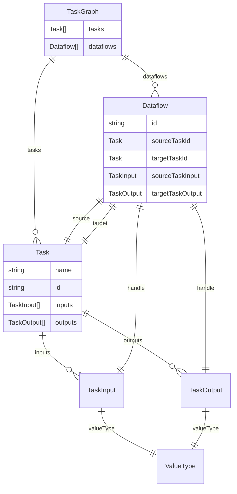

# Run Graph Orchestration

## Introduction

We have Tasks (preprammed to do some action), JobQueueTask types (these get posted to job queues), and Compound task types (a task with isCompound=true that contains a subgraph) that contain a whole graph. These are all internal and must be defined in code.

When an end user want to build a pipeline, they need to be able to define a list of tasks to run. This is where Graphs come in. The directed acyclic graph (DAG) is more flexible than simple chains.

The editor DAG is defined by the end user and saved in the database (nodes and edges), filesystem, etc.

## Graph

The graph is a DAG. It is a list of nodes and a list of edges. The nodes are the tasks and the edges are the inputs and outputs of the tasks plus some other instrumetation data.

We might want to have events based on what happens in the graph (and a suspend/resume for bulk creation/etc). This will be needed to keep UI in sync with the as it runs.

### Node / Task

- Task

Notes about requirements for the tasks:

- Must have input list and output list
  - the input or output will have a type object that JS can read, and not a TS type (though that should get derived from the type object)
- We need to convert the inputs/outputs to a TypeScript type (or write them separately)

### Edge / Dataflow

- Dataflow
- Instrumentation

Notes about requirements for the edges:

- There can be multiple outputs that go to multiple inputs
  - I.g., there can and will be multiple edges between two nodes

### Graph Runner

The graph runner is a simple recursive function that takes a graph and a node and runs the node. If the node is a task, it runs the task. If the node has a sub-graph, it runs the sub-graph.

# User Task Graph

